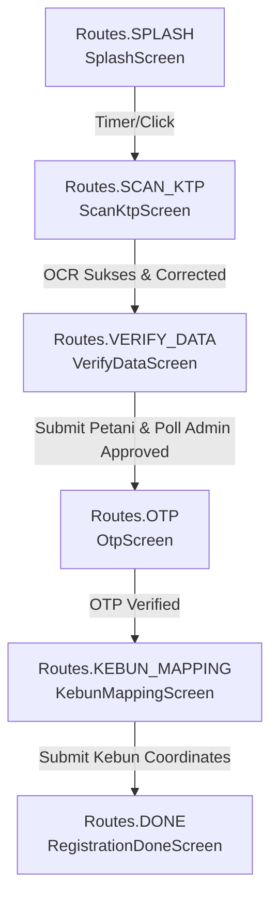

# AI Prompt & Project Reference Context: Kakao Digital (Android/Kotlin)

> **Dokumen ini dirancang khusus sebagai referensi konteks ekstensif (Prompt Reference / Project Context) bagi AI Assistant, Software Engineer, atau System Architect yang akan mengembangkan, merombak, atau melakukan debug pada repositori `kakao-android`.**
> Dokumen ini membedah arsitektur saat ini, status integrasi network asli vs mock, logika heuristik OCR dan pemetaan wilayah, hingga alur state management pada setiap komponen secara detail.

---

## 1. Ringkasan Proyek & Tujuan Usaha
**Kakao Digital** adalah aplikasi Android berbasis **Kotlin & Jetpack Compose** yang dikembangkan untuk memfasilitasi alur pendaftaran petani kakao di bawah operasional **PT. Berau Coal** (utamanya di wilayah Kalimantan Timur).

Aplikasi ini menggantikan alur pendaftaran manual dengan alur otomatis berbasis on-device AI (ML Kit OCR) dan integrasi dashboard NocoBase serta notifikasi WhatsApp Fonnte dengan tahapan E2E sebagai berikut:
1. **Splash Screen** & Izin Perangkat (Camera & Location).
2. **Scan KTP**: Pembacaan KTP secara real-time via kamera HP (CameraX + ML Kit Text Recognition).
3. **Koreksi Wilayah (WilayahCorrector)**: Pencocokan string OCR miring/typo ke database resmi BPS/Kemendagri secara offline menggunakan Levenshtein Distance yang dibatasi lingkup (hierarkis).
4. **Verifikasi Data Petani**: Koreksi form secara manual oleh petani/admin & pengiriman data ke backend (NocoBase) diikuti dengan mekanisme polling status persetujuan dari admin.
5. **Verifikasi OTP WhatsApp**: Pengiriman kode verifikasi 6 angka melalui API Fonnte ke WhatsApp calon petani.
6. **Pemetaan Kebun (Kebun Mapping)**: Penentuan titik koordinat (latitude, longitude) serta perkiraan luas kebun berbasis Google Maps Compose, lalu divalidasi dan disimpan ke NocoBase.
7. **Selesai (Done Screen)**: Konfirmasi akhir pendaftaran petani dan kebun berhasil tersimpan.

---

## 2. Status Konfigurasi Lingkungan Saat Ini (Live vs Mock)

> [!IMPORTANT]
> **PERBEDAAN DENGAN README LAMA:** Meskipun `README.md` awal menyatakan bahwa aplikasi dalam status `MOCK_MODE = true`, pemeriksaan pada kode implementasi aktual di [`RegistrationRepository.kt`](file:///d:/Berau/kakao-android/app/src/main/java/com/beraucoal/kakao/network/RegistrationRepository.kt#L14-L15) menunjukkan bahwa **kedua flag mock saat ini bernilai FALSE**:
> - `MOCK_NOCOBASE = false` -> **Menggunakan koneksi jaringan ASLI ke NocoBase.**
> - `MOCK_FONNTE = false` -> **Menggunakan koneksi jaringan ASLI untuk mengirim OTP WhatsApp Fonnte.**

### Rincian Integrasi External:
1. **NocoBase (Backend & Admin Dashboard)**
   - **Endpoint Base URL**: `https://great-roses-hear.loca.lt/` (Dikonfigurasi di [`RetrofitClient.kt`](file:///d:/Berau/kakao-android/app/src/main/java/com/beraucoal/kakao/network/RetrofitClient.kt#L14)).
   - **Sifat Endpoint**: Menggunakan **Localtunnel** (`loca.lt`) yang mengarah ke server lokal tim Backend. *Catatan untuk AI: Jika koneksi API gagal dengan Timeout / DNS error, hal pertama yang harus diperiksa adalah apakah URL tunnel lokal ini telah berganti.*
   - **Otentikasi NocoBase**: Menggunakan JWT Token Login (root role, kedaluwarsa **28 Oktober 2026**), dikirim lewat header `Authorization: Bearer <token>`.
   - **Header Khusus**: Interceptor menambahkan header `Bypass-Tunnel-Reminder: true` untuk menembus halaman peringatan HTML default dari Localtunnel agar Retrofit langsung menerima payload JSON murni dari NocoBase.
2. **Fonnte (Provider WhatsApp Message / OTP)**
   - **Endpoint Base URL**: `https://api.fonnte.com/`
   - **Otentikasi Fonnte**: Device Token (`bzGH48RPvCAi9XWT43hv`) dikirim pada header `Authorization: <token>` (**TANPA** prefix `Bearer`).
   - **Keamanan OTP**: Fonnte hanya bertindak sebagai *message sender* murni. Kode OTP random 6-digit **di-generate dan divalidasi langsung di client-side memory** (`activeOtpCodes: MutableMap<String, String>` pada `RegistrationRepository`). *Catatan untuk AI Architecture Refactoring: Untuk skala produksi besar, logika pembuatan dan verifikasi OTP harus dipindahkan ke backend custom action NocoBase.*

---

## 3. Technology Stack & Versi

Semua spesifikasi pustaka terdaftar secara eksplisit dalam [`app/build.gradle.kts`](file:///d:/Berau/kakao-android/app/build.gradle.kts).

| Komponen / Layer | Teknologi / Pustaka | Versi & Referensi |
| :--- | :--- | :--- |
| **Language & SDK** | Kotlin, JDK 17 | `minSdk = 26` (Android 8.0), `targetSdk = 34`, `compileSdk = 34`, JVM Target 17 |
| **Architecture** | MVVM, Single-Activity, declarative UI | Jetpack Compose BOM `2024.06.00`, Material 3 |
| **State Management** | Unidirectional Data Flow (UDF) via StateFlow | `kotlinx-coroutines-android:1.8.1`, `lifecycle-viewmodel-compose:2.8.2` |
| **Navigation** | Jetpack Navigation Compose | `androidx.navigation:navigation-compose:2.7.7` (`NavHostController`) |
| **Camera & Media** | CameraX (Lifecycle, Camera2, View, Core) | `androidx.camera:camera-*:1.3.4` |
| **OCR / On-Device AI**| Google ML Kit Text Recognition (Latin) | `com.google.mlkit:text-recognition:16.0.1` (Gratis & On-Device) |
| **Network Client** | Retrofit + OkHttp + Gson | `retrofit:2.11.0`, `converter-gson:2.11.0`, `okhttp3-logging-interceptor:4.12.0` |
| **Maps & Location** | Google Maps SDK for Android & Maps Compose | `play-services-maps:19.0.0`, `maps-compose:4.4.1`, `play-services-location:21.3.0` |
| **Offline Data Storage**| Compressed GZ Assets | GZ-compressed `.txt.gz` datasets untuk BPS/Kemendagri wilayah matching |

---

## 4. Arsitektur Komponen & Alur Data (Flow)

Aplikasi dipisah menjadi 4 layar/paket utama di bawah `com.beraucoal.kakao`:
1. `data/`: Data models & enum state ([`RegistrationModels.kt`](file:///d:/Berau/kakao-android/app/src/main/java/com/beraucoal/kakao/data/RegistrationModels.kt)).
2. `network/`: Retrofit interfaces, DTOs, OkHttp interceptors & Repositories ([`ApiService.kt`](file:///d:/Berau/kakao-android/app/src/main/java/com/beraucoal/kakao/network/ApiService.kt), [`RetrofitClient.kt`](file:///d:/Berau/kakao-android/app/src/main/java/com/beraucoal/kakao/network/RetrofitClient.kt), [`RegistrationRepository.kt`](file:///d:/Berau/kakao-android/app/src/main/java/com/beraucoal/kakao/network/RegistrationRepository.kt)).
3. `ocr/`: Pemrosesan gambar, rekonstruksi koordinat kotak teks OCR, dan fuzzy koreksi wilayah ([`KtpOcrAnalyzer.kt`](file:///d:/Berau/kakao-android/app/src/main/java/com/beraucoal/kakao/ocr/KtpOcrAnalyzer.kt), [`WilayahCorrector.kt`](file:///d:/Berau/kakao-android/app/src/main/java/com/beraucoal/kakao/ocr/WilayahCorrector.kt)).
4. `ui/screens/`: 6 Layar Jetpack Compose yang mewakili tiap langkah wizards pendaftaran.

---

## 5. Bedah Spesifik & Flow Tiap Komponen (End-to-End)

### A. Core Entry Point, State Holder & Navigasi
- **[`MainActivity.kt`](file:///d:/Berau/kakao-android/app/src/main/java/com/beraucoal/kakao/MainActivity.kt)**: Entry point aktivitas tunggal Android. Saat dibuat, meminta izin runtime yang diperlukan: `CAMERA`, `ACCESS_FINE_LOCATION`, dan `ACCESS_COARSE_LOCATION` sebelum menampilkan root layout `RegistrationNavGraph`.
- **[`RegistrationNavGraph.kt`](file:///d:/Berau/kakao-android/app/src/main/java/com/beraucoal/kakao/RegistrationNavGraph.kt)**: Menginisialisasi 1 instan **`RegistrationViewModel`** yang dibagikan (shared scope) ke semua rute di dalam `NavHost`. Rute rilis tertutup dalam object `Routes`:
  - `splash` -> `scan_ktp` -> `verify_data` -> `otp` -> `kebun_mapping` -> `done`.
- **[`RegistrationViewModel.kt`](file:///d:/Berau/kakao-android/app/src/main/java/com/beraucoal/kakao/RegistrationViewModel.kt)**: Menyimpan state global aplikasi dalam bentuk dua buah `StateFlow`:
  - `_registration: MutableStateFlow<PetaniRegistration>`: Berisi seluruh payload (`ktpData`, `nomorWhatsapp`, `verificationStatus`, `otpVerified`, `kebunLocation`, dan `petaniId` yang dikembalikan oleh backend).
  - `_uiState: MutableStateFlow<UiState>`: Bertransformasi antara `Idle`, `Loading`, dan `Error(message)` untuk menampilkan progress generator atau snackbar/dialog kesalahan di UI.



---

### B. Tahap 1: Scan KTP & Kecerdasan Buatan On-Device (OCR + Wilayah)
Layar **[`ScanKtpScreen.kt`](file:///d:/Berau/kakao-android/app/src/main/java/com/beraucoal/kakao/ui/screens/ScanKtpScreen.kt)** menampilkan kamera live menggunakan CameraX (`Preview` & `ImageCapture`). Ketika user mengambil foto:
1. Bitmap foto dikirim ke **[`KtpOcrAnalyzer.kt`](file:///d:/Berau/kakao-android/app/src/main/java/com/beraucoal/kakao/ocr/KtpOcrAnalyzer.kt)** via coroutines.
2. **Heuristik 1: Rekonstruksi Baris (Row Reordering)**
   - *Masalah*: KTP Indonesia memiliki layout 2 kolom (Kolom Label di kiri, Kolom Isi/Value di kanan). Keluaran string default ML Kit (`Text.text`) sering mengelompokkan teks berdasar kolom tegak berhadapan sehingga urutannya teracak berantakan.
   - *Solusi `reconstructRowOrder()`*: Menganalisis *bounding box* dari seluruh `Text.Line`. Garis teks dengan koordinat Y pusat yang berdekatan (dalam batas toleransi `0.6 * rata-rata tinggi font`) dikelompokkan sebagai satu "Baris Fisik" (Row). Di dalam satu Row, kata-kata distabilkan secara horizontal dari kiri ke kanan (berdasarkan koordinat X `left`). Hasilnya jaminan string terstruktur: `<Label> <Value>`.
3. **Heuristik 2: Parsing Berdasarkan Posisi Relatif dari NIK & Prefix Stripping**
   - Di KTP Indonesia, field isi selalu dicetak dalam **HURUF KAPITAL** atau **ANGKA**, sedangkan label bercampur huruf kecil. Fungsi `stripLabelPrefix()` memotong kata awalan non-kapital murni.
   - Karena OCR kerap salah baca teks label (misal: "Jenis klamin", "TempatIgi Lahir"), analyzer mencari letak baris **NIK** (regex 16 digit `\b\d{16}\b`) terlebih dahulu. Dari baris NIK, offset baris standar diterapkan secara pasti:
     - `Offset +1` -> Nama
     - `Offset +2` -> Tempat / Tanggal Lahir (TTL)
     - `Offset +4` -> Alamat
     - `Offset +6` -> Kelurahan / Desa
     - `Offset +7` -> Kecamatan
   - Jika posisi baris kosong (akibat terpotong), sistem beralih (fallback) menggunakan pencarian fuzzy terhadap teks label hints.
   - Menghasilkan object `KtpData` dengan kalkulasi keyakinan (`OcrConfidence.HIGH` jika NIK 16 digit & Nama ada; sebaliknya `MEDIUM` / `LOW`).
4. **Heuristik 3: Koreksi Hierarkis Wilayah Indonesia ([`WilayahCorrector.kt`](file:///d:/Berau/kakao-android/app/src/main/java/com/beraucoal/kakao/ocr/WilayahCorrector.kt))**
   - Mengatasi cacat OCR huruf miring pada daerah (misal "GKAMPEK" -> "CIKAMPEK").
   - Membongkar dan membaca asset bertekanan (`wilayah/regencies.txt.gz`, `districts.txt.gz`, `villages.txt.gz`) di dalam memori saat pemanggilan pertama (`ensureLoaded()`).
   - *Pencocokan Bertahap & Dibatasi Lingkup*:
     1. **Kabupaten/Kota**: Mengekstrak baris ke-2 dari raw teks KTP (di bawah baris "PROVINSI"), dicocokkan dengan rasio **Levenshtein Distance** ke seluruh Kabupaten/Kota Indonesia (threshold >= `0.5`).
     2. **Kecamatan**: Mencari rasio kemiripan terbaik (threshold >= `0.6`) **HANYA** dari daftar kecamatan di bawah kode Kabupaten yang ditemukan di Langkah 1.
     3. **Kelurahan/Desa**: Mencari kemiripan terbaik (threshold >= `0.6`) **HANYA** dari daftar desa di bawah kode Kecamatan yang ditemukan di Langkah 2.
   - Mengirim kembali object `KtpData` yang sudah diperbaiki ke ViewModel melalui `viewModel.onKtpScanned(ktp)`.

---

### C. Tahap 2: Verifikasi Data, Submit NocoBase, dan Polling Admin
Layar **[`VerifyDataScreen.kt`](file:///d:/Berau/kakao-android/app/src/main/java/com/beraucoal/kakao/ui/screens/VerifyDataScreen.kt)** memberi kesempatan pengguna menyunting hasil ekstraksi OCR dan menginput nomor WhatsApp.
1. Ketika tombol konfirmasi diklik, `ViewModel.submitForVerification()` memanggil `repository.submitPetani()`.
2. **REST API ke NocoBase ([`ApiService.kt`](file:///d:/Berau/kakao-android/app/src/main/java/com/beraucoal/kakao/network/ApiService.kt))**:
   - Menyetel Request POST ke endpoint `api/petani:create` dengan struktur JSON *flat* (`PetaniFields` yang berisi: `nik`, `nama`, `alamat`, `kelurahanDesa`, `kecamatan`, `nomorWhatsapp`).
   - Mendapatkan response `NocoBaseSingleResponse<PetaniRecord>` dan menyimpan ID database petani (`petaniId`) ke `PetaniRegistration`.
3. **Mekanisme Polling Status**:
   - Setelah ID petani tersimpan, Repository langsung memukul endpoint `GET api/petani:get?filterByTk=<id>` untuk mengecek apakah admin meloskan pendaftaran (`pollVerificationStatus`).
   - Pemetaan nilai status di `RegistrationRepository`: 
     - String `"disetujui"` atau `"approved"` -> `VerificationStatus.DISETUJUI`
     - String `"ditolak"` atau `"rejected"` -> `VerificationStatus.DITOLAK`
     - String lainnya -> `VerificationStatus.PENDING`
   - *Catatan UI*: Jika status masih `PENDING`, pengguna diberikan tombol refresh/recheck. Jika `DISETUJUI`, navigasi melompat ke rute OTP.

---

### D. Tahap 3: WhatsApp OTP Messaging (Fonnte)
Layar **[`OtpScreen.kt`](file:///d:/Berau/kakao-android/app/src/main/java/com/beraucoal/kakao/ui/screens/OtpScreen.kt)** menangani autentikasi kepemilikan nomor telepon.
1. `ViewModel.sendOtp()` men-trigger `repository.sendOtp()`.
2. **Normalisasi Nomor Telepon**: `normalizeWhatsappNumber()` di `RegistrationRepository` mengubah karakter non-digit dan mengganti awalan `"0"` menjadi `"62"` (standar internasional yang disyaratkan Fonnte).
3. **Generate Kode Client-Side**:
   - Angka acak 6 digit (`Random.nextInt(100000, 999999)`) dibangkitkan dan disimpan ke dalam memori client: `activeOtpCodes[requestId] = code`.
   - Mengirim request POST ke endpoint `https://api.fonnte.com/send` (menggunakan Form URL-Encoded: `target` & `message` dengan Header `Authorization: <device_token>`).
4. **Verifikasi OTP**:
   - Saat pengguna memasukkan 6 angka di UI, `ViewModel.verifyOtp()` membandingkan input dengan nilai di memori `activeOtpCodes`.
   - Jika cocok, kode dihabiskan (dihapus dari map untuk menjamin *one-time use*), flag `otpVerified = true`, dan rute beralih ke Pemetaan Kebun.

---

### E. Tahap 4: Pemetaan Kebun (Google Maps Compose)
Layar **[`KebunMappingScreen.kt`](file:///d:/Berau/kakao-android/app/src/main/java/com/beraucoal/kakao/ui/screens/KebunMappingScreen.kt)** menampilkan UI Peta interaktif.
1. **Peta Default**: Mengarahkan kamera secara default ke koordinat wilayah **Kalimantan Timur** (perkiraan lokasi konsesi/kebun binaan PT. Berau Coal). *Catatan untuk AI: Memerlukan API Key Google Maps asli di `AndroidManifest.xml` agar peta tidak berlayar hitam/blank.*
2. Pengguna dapat menggeser pin lokasi (mengubah `latitude` dan `longitude`), serta mengisi estimasi `luasHektar` kebun.
3. Klik simpan memicu `ViewModel.submitKebun()`, yang menembakkan request POST ke endpoint NocoBase: `api/kebun:create` berisi DTO `KebunFields` (`petaniId`, `latitude`, `longitude`, `luasHektar`).
4. Jika server menjawab sukses (`200 OK` atau `201 Created`), state `kebunLocation` tercatat di `ViewModel` dan rute berlanjut ke layar akhir.

---

### F. Tahap 5: Penyelesaian (Done Screen)
Layar **[`DoneScreen.kt`](file:///d:/Berau/kakao-android/app/src/main/java/com/beraucoal/kakao/ui/screens/DoneScreen.kt)** (dikenali dengan fungsi `@Composable RegistrationDoneScreen`) adalah layar terminasi yang menyajikan ucapan selamat dan rangkuman data singkat bahwa petani dan titik koordinat lahan kakao telah berhasil direkam ke ekosistem Kakao Digital NocoBase.

---

## 6. Referensi Skema API & DTO (Data Transfer Objects)

AI yang ingin memodifikasi atau menambah field baru wajib menjaga kesesuaian parameter dari dua kelas DTO di bawah ini terhadap nama kolom nyata pada tabel NocoBase tim Backend:

```kotlin
// DTO Registrasi Petani -> Tabel NocoBase: 'petani'
data class PetaniFields(
    val nik: String,
    val nama: String,
    val alamat: String,
    val kelurahanDesa: String,
    val kecamatan: String,
    val nomorWhatsapp: String,
    val status: String? = null // Default dari server biasanya 'pending'
)

// DTO Pemetaan Kebun -> Tabel NocoBase: 'kebun'
data class KebunFields(
    val petaniId: Long,        // Foreign key mengarah ke ID Petani
    val latitude: Double,
    val longitude: Double,
    val luasHektar: Double?
)
```

---

## 7. Pedoman Penting bagi AI saat Eksekusi Tugas / Prompting Baru

1. **JANGAN merubah alur Heuristik Rekonstruksi Baris di `KtpOcrAnalyzer.kt`** kecuali dimintai modifikasi algoritma secara eksplisit oleh user. Mengandalkan `visionText.text` bawaan dari ML Kit pada kartu 2 kolom (seperti KTP Indonesia) bergaransi merusak urutan pembacaan.
2. **Kesesuaian Kolom NocoBase**: Bila diminta menambahkan field baru pada form (contoh: *Nomor KK* atau *Agama*), pastikan untuk menambahkan propertinya secara serentak pada 3 layer: `KtpData` (Data model), `VerifyDataScreen` (UI Compose Form), dan `PetaniFields` (DTO Retrofit di `ApiService.kt`).
3. **Koneksi Localtunnel & Token NocoBase**: Apabila bertugas melakukan *end-to-end network debugging*, pastikan untuk mengecek integritas `NOCOBASE_BASE_URL` dan kedaluwarsa `NOCOBASE_API_KEY` di `RetrofitClient.kt`. Header `Bypass-Tunnel-Reminder: true` tidak boleh dihapus jika masih beroperasi via Localtunnel.
4. **Mekanisme Mocking**: Untuk pengujian lokal tanpa internet atau saat server backend tidak aktif, AI dapat menyarankan atau merubah konstanta `MOCK_NOCOBASE = true` dan `MOCK_FONNTE = true` pada baris awal file [`RegistrationRepository.kt`](file:///d:/Berau/kakao-android/app/src/main/java/com/beraucoal/kakao/network/RegistrationRepository.kt#L14-L15). Dalam mode mock, OTP valid selalu `123456`.
5. **UI & Styling**: Pertahankan penggunaan pola Jetpack Compose deklaratif dan *unidirectional data flow*. Gunakan `StateFlow.asStateFlow()` dari `ViewModel` dan pantau nilainya menggunakan `collectAsState()` di layer UI.
