# Dokumentasi Alur UX & Sistem Pemetaan (GIS) Kakao Digital

> **Dokumen ini dirancang sebagai panduan komprehensif bagi Engineer, UI/UX Designer, dan System Architect untuk merancang, mengembankan, dan memperluas alur pengalaman pengguna (User Experience Flow) serta sistem arsitektur peta pada aplikasi Kakao Digital.**
> Dokumen ini mencakup analisis alur eksisting, hierarki data geospasial, mekanisme rendering interaktif, hingga *blueprint* pengembangan fitur GIS tahap selanjutnya.

---

## 1. Ringkasan Eksekutif & Struktur Pemetaan

Dalam ekosistem **Kakao Digital (PT. Berau Coal)**, modul pemetaan (Maps/GIS) tidak sekadar menjadi penunjuk lokasi, melainkan instrumen utama untuk:
1. **Validasi Lokasi Pendaftaran (Onboarding Geotagging):** Memastikan kebun calon petani berada di dalam zona hak pilih atau konsesi program pendampingan.
2. **Manajemen Aset Pertanian (Precision Agriculture GIS):** Pemetaan batas area perkebunan (Polygon), subdivisi blok kelola, hingga pemantauan kesehatan per individu pohon kakao secara spasial.

Saat ini, implementasi pemetaan dalam repositori dibagi menjadi **2 Alur UX Utama**:
- **Alur 1: Penentuan Koordinat Lahan Baru (Registration Stage)** -> Ditangani oleh [KebunMappingScreen.kt](file:///d:/Berau/kakao-android/app/src/main/java/com/beraucoal/kakao/ui/screens/KebunMappingScreen.kt).
- **Alur 2: Pemantauan Satelit & Inspeksi Lahan (Dashboard Stage)** -> Ditangani oleh [SatelliteMapScreen.kt](file:///d:/Berau/kakao-android/app/src/main/java/com/beraucoal/kakao/ui/screens/SatelliteMapScreen.kt) dan [PlantationBottomSheet.kt](file:///d:/Berau/kakao-android/app/src/main/java/com/beraucoal/kakao/ui/components/PlantationBottomSheet.kt).

```mermaid
graph TD
    subgraph Onboarding [Alur Registrasi / Onboarding]
        A[Verification OTP Sukses] --> B[KebunMappingScreen]
        B -->|Opsi 1: Manual Tap| C[Pin Marker di Peta]
        B -->|Opsi 2: Sensor GPS| D[Auto Re-center & Pin via GPS]
        C --> E[Input Estimasi Luas Hektar]
        D --> E
        E -->|POST api/kebun:create| F[NocoBase Backend]
    end

    subgraph Monitoring [Alur Dashboard / Pemantauan Pasca-Login]
        G[Tab Navigasi: Peta Satelit] --> H[SatelliteMapScreen]
        H -->|Layer 1: Polygon Emas| I[Area Perkebunan Utama]
        I -->|Layer 2: Polygon Hijau| J[Sub-Blok Lahan]
        J -->|Layer 3: Zoom >= 15f| K[Pin Marker Pohon Kakao]
        K -->|Filter Status| L[Sehat / Perlu Pupuk / Hama]
        L -->|Klik Inspek/Buka BottomSheet| M[PlantationBottomSheet]
        M -->|Action| N[Update Status Kesehatan Pohon]
    end
```



---

## 2. Bedah Alur UX 1: Registrasi & Pemetaan Kebun Baru (`KebunMappingScreen`)

Layar [KebunMappingScreen.kt](file:///d:/Berau/kakao-android/app/src/main/java/com/beraucoal/kakao/ui/screens/KebunMappingScreen.kt) diakses pada **Langkah 4 (Tahap Akhir Onboarding)** pasca verifikasi nomor WhatsApp.

### A. Tujuan & Pengalaman Pengguna (UX)
* **Konteks Lapangan:** Petani atau Petugas Lapangan (Penyuluh) berada di lahan atau di kantor pendaftaran, membutuhkan cara cepat dan akurat untuk merekam titik tengah (Centroid/Marker) dari lahan kakao yang didaftarkan.
* **Tantangan UX:** Petani mungkin tidak terbiasa menggeser peta digital, sehingga antarmuka harus meminimalkan kesalahan ketuk (fat-finger errors) dan menyediakan jalan pintas perangkat keras (GPS).

### B. Alur Interaksi Kritis (Interactive State Flow)
1. **Inisialisasi Kameran Peta:** 
   - Peta diaktifkan pada koordinat default **Wilayah Berau, Kalimantan Timur** (`2.1500, 117.4667`) dengan tingkat pergeseran *zoom* `12f`.
   - Menggunakan komponen `GoogleMap` dari library `maps-compose` dengan parameter `MapProperties(isMyLocationEnabled = hasLocationPermission)`.
2. **Akuisisi Koordinat (2 Jalur Input):**
   - **Jalur A - Manual Interactive Mapping:** 
     Pengguna mengekstraksi visual peta, menggeser (*pan*) dan memperbesarnya (*zoom*), lalu menyentuh layar (`onMapClick`). Event ini memperbarui state `pinnedLocation` dan langsung menyebarkan animasi marker ke posisi yang disentuh.
   - **Jalur B - Hardware Sensor GPS (Recommended for Field Officers):** 
     Jika izin akses lokasi (`ACCESS_FINE_LOCATION`) diizinkan pada awal instalasi, kartu bawah menampilkan tombol utama: **"Gunakan Lokasi GPS Saya Saat Ini"**.
     Saat ditekan, aplikasi memanggil `FusedLocationProviderClient.lastLocation`. Jika koordinat berhasil ditangkap:
     - `pinnedLocation` disetel secara matematis ke lokasi satelit GPS.
     - Kamera peta secara otomatis melompat (*animate camera position*) ke titik tersebut dengan zoom interaktif `16f` (pembesaran detail area kebun).
3. **Pengisian Metadata Tambahan:**
   - Di bawah tombol GPS, tersedia kolom `KakaoOutlinedTextField` untuk pengisian **Estimasi Luas Kebun (Hektar)** yang bersifat opsional.
4. **Validasi & Transisi Data:**
   - Tombol utama **"Simpan & Selesaikan Registrasi"** dikunci (*disabled*) hingga `pinnedLocation != null`.
   - Saat diklik, fungsi `viewModel.submitKebun(lat, lng, luas, onDone)` dipanggil.
   - **Network Pipeline:** Repository memformat DTO `KebunFields` (`petaniId`, `latitude`, `longitude`, `luasHektar`) dan meluncurkan request `POST` ke NocoBase di `api/kebun:create`.
   - Setelah respons kesuksesan diterima (`200/201`), Navigasi melonjak ke layar konfirmasi `Routes.DONE`.

---

## 3. Bedah Alur UX 2: Dashboard Satelit GIS & Inspeksi Lahan (`SatelliteMapScreen`)

Layar [SatelliteMapScreen.kt](file:///d:/Berau/kakao-android/app/src/main/java/com/beraucoal/kakao/ui/screens/SatelliteMapScreen.kt) merupakan jantung dari pengalaman **Monitoring & Manajemen Aset Perkebunan** di dalam aplikasi utama (dapat diakses melaui menu navigasi bawah / `KakaoBottomNavigation`).

### A. Konsep Hierarki Spasial 3-Lapisan (3-Layer GIS Hierarchy)
Untuk mencegah *visual clutter* (terlalu banyak ikon menumpuk di peta) dan menghemat pemrosesan grafis (GPU RAM), antarmuka ini mengimplementasikan teknik **Progressive Disclosure** berbasis level zoom:

| Lapisan Spasial | Representasi UI | Atribut Tampilan | Kondisi Muncul di Peta |
| :--- | :--- | :--- | :--- |
| **Layer 1: Perkebunan (KebunArea)** | Polygon Area Utama | Isi Emas Transparan (`0x33F1C40F`), Garis Tepi Emas (`5f`) | Selalu muncul pada setiap level zoom |
| **Layer 2: Blok Lahan (BlokBagian)** | Polygon Sub-Divisi | Isi Hijau Zamrud Transparan (`0x222ECC71`), Garis Tepi (`3f`) | Selalu muncul di dalam perimeter Layer 1 |
| **Layer 3: Pohon Kakao (PohonKakao)**| Marker / Pin Titik | Ikon Pin dengan variasi warna berdasar status kesehatan | **Hanya muncul saat Zoom Level >= 15f** |

### B. Alur Manajemen Kontrol Peta (Top Bar & Floating Controls)
1. **Pilih Kendali Lapisan (Map Type Switcher):**
   - Pengguna dapat mengklik ikon `Layers` di bilah atas untuk berotasi antar mode presentasi citra: `SATELLITE` (Citra Udara/Satelit Asli) ➔ `HYBRID` (Citra Udara + Nama Jalan/Label) ➔ `NORMAL` (Peta Vektor Google konvensional).
2. **Mekanisme Filter Status Real-time (Quick Filter Chips):**
   - Terdapat 3 Chip interaktif di bagian atas:
     - **Semua Pohon:** Menampilkan seluruh titik tanaman yang terdata.
     - **⚠️ Terserang Hama:** Memfilter tampilan agar HANYA menengahkan pohon dengan status `PohonStatus.TERSERANG_HAMA` (Warna Pin Merah). Sangat berguna bagi tim proteksi tanaman / agronomi untuk menemukan epicenter serangan hama PBK (Pengerek Buah Kakao) atau penyakit VSD (Vascular Streak Dieback).
     - **⚡ Perlu Pupuk:** Menampilkan HANYA pohon dengan status `PohonStatus.PERLU_PUPUK` (Warna Pin Kuning/Gold) untuk optimasi alur logistik pemupukan di lapangan.
3. **Tombol Interaktif FAB (Floating Action Buttons):**
   - **Location FAB (Atas):** Mengembalikan pusat kamera ke `centerLocation` dari perkebunan yang sedang terpilih di zoom `16f`.
   - **Inspeksi Lahan FAB (Bawah):** Membuka menu inspektor modal (*Modal Bottom Sheet*) untuk manajemen data perkebunan dari perspektif daftar tebal (List & Grid view).

### C. Alur Inspeksi & Modifikasi Data via `PlantationBottomSheet`
Ketika polygon kebun/blok di-klik, atau tombol FAB Inspeksi ditekan, [PlantationBottomSheet.kt](file:///d:/Berau/kakao-android/app/src/main/java/com/beraucoal/kakao/ui/components/PlantationBottomSheet.kt) terbuka meluncur dari bawah layar:
1. **Stat Piles & Header:** Menampilkan judul kebun, nama pemilik, luas hektar, dan 3 pilar statistik kesehatan (`Sehat`, `Butuh Pupuk`, `Hama`) yang berhitung secara dinamis dari agregasi data pohon.
2. **Navigasi 3-Tab Multilevel:**
   - **Tab 0 - Ringkasan (Overview):** Rangkuman metrik produktivitas kebun dan informasi umum.
   - **Tab 1 - Sub-Blok:** Menampilkan daftar divisi Blok. **Interaksi Kritis:** Ketika pengguna mengklik salah satu kartu Sub-Blok, aplikasi merespons dengan memilih blok tersebut (`onBlokSelected(it)`) dan **secara otomatis menggeser fokus pengguna ke Tab 2 (Daftar Pohon)** yang kini tersortir khusus untuk blok yang dipilih.
   - **Tab 2 - Daftar Pohon & Audit Kesehatan:** Menampilkan daftar kartu pohon kakao individual beserta usia, varietas (misal: *MCC 02 Sulawesi 2*), estimasi hasil panen (Kg), dan tanggal pemupukan terakhir.
3. **Alur Aksi Perubahan Status Kesehatan (Field Audit Flow):**
   - Pengguna (Mandor/Petugas) dapat merubah status kesehatan pohon langsung melalui dropdown/tombol pada kartu pohon.
   - Aksi ini memicu callback `onStatusChange`, yang dieksekusi oleh `plantationRepository.updatePohonStatus()`. Secara real-time, warna pin marker pada `GoogleMap` utama langsung berubah dari Merah ke Hijau (jika terobati) atau dari Hijau ke Kuning (jika masa pemupukan tiba).

---

## 4. Arsitektur Teknis & Struktur Skema Data (Data Model & Schema Reference)

Untuk mendukung alur GIS di atas, arsitektur data dibentuk dan dikunci di dalam [PlantationModels.kt](file:///d:/Berau/kakao-android/app/src/main/java/com/beraucoal/kakao/data/PlantationModels.kt). Berikut adalah skema strukturalnya:

```kotlin
// Status Kesehatan dengan Kodifikasi Label
enum class PohonStatus(val label: String) {
    SEHAT("Sehat"),
    PERLU_PUPUK("Butuh Pemupukan"),
    TERSERANG_HAMA("Terserang Hama PBK/VSD")
}

// Entity Lapisan 3: Individu Pohon
data class PohonKakao(
    val id: String,
    val kodePohon: String,              // Contoh: "P-01-A"
    val location: LatLng,               // Titik Koordinat Presisi
    val umurTahun: Double,              // Usia tanaman (Tahun)
    val status: PohonStatus,            // Enumerasi Status
    val tanggalPemupukanTerakhir: String,
    val varietasKakao: String = "MCC 02 (Sulawesi 2)",
    val estimasiHasilKg: Double = 3.5,
    val catatanPetani: String
)

// Entity Lapisan 2: Divisi Sub-Blok
data class BlokBagian(
    val id: String,
    val kodeBlok: String,
    val namaBlok: String,
    val polygon: List<LatLng>,          // Rangkaian koordinat penutup area Blok
    val pohonList: List<PohonKakao>     // Relasi One-to-Many ke Pohon
) {
    val totalPohon: Int get() = pohonList.size
    val pohonSehatCount: Int get() = pohonList.count { it.status == PohonStatus.SEHAT }
    val pohonHamaCount: Int get() = pohonList.count { it.status == PohonStatus.TERSERANG_HAMA }
    val pohonPupukCount: Int get() = pohonList.count { it.status == PohonStatus.PERLU_PUPUK }
}

// Entity Lapisan 1: Induk Perkebunan
data class KebunArea(
    val id: String,
    val namaKebun: String,
    val namaPemilik: String,
    val idPetani: String,
    val nomorWa: String,
    val luasHektar: Double,
    val centerLocation: LatLng,         // Centroid untuk fokus kamera default
    val polygon: List<LatLng>,          // Rangkaian koordinat batas terluar Lahan
    val blokList: List<BlokBagian>      // Relasi One-to-Many ke Sub-Blok
)
```

---

## 5. Blueprint & Roadmap Pengembangan Sistem Pemetaan Lanjutan (Next-Step Development)

Sebagai panduan pengembangan lebih lanjut (*Next User Flow Development*), berikut adalah 5 pilar rancang bangun yang dirancang untuk meresap dan meningkatkan sistem peta Kakao Digital saat ini:

### 1. Evolusi UX Registrasi: dari "Single-Pin" ke "Polygon Geofence Drawing"
* **Kelemahan Saat Ini:** Di [KebunMappingScreen.kt](file:///d:/Berau/kakao-android/app/src/main/java/com/beraucoal/kakao/ui/screens/KebunMappingScreen.kt), pengguna hanya menyematkan satu titik pin (Centroid) dan memasukkan luas lahan (Hektar) secara manual via textfield, yang rawan terjadi salah taksir (inaccuracy/manipulation).
* **Solusi Pengembangan (Feature Requirement):**
  - **Mode Gambar Titik Batas (Polygon Draw Tool):** Izinkan petani/petugas mengklik 4 atau lebih titik sudut lahan secara berurutan di layar satelit untuk membentuk garis tertutup (Polygon).
  - **Kalkulator Luas Otomatis (Shoelace Geodesic Formula):** Implementasikan kalkulasi geometri bola (*Spherical Area Calculation* dari `SphericalUtil.computeArea()` bawaan `google-maps-utils`) untuk menghitung luas meter persegi / hektar secara otomatis berdasarkan batas polygon tersebut, menonaktifkan kebutuhan input manual yang rentan bias.
  - **Tombol "Undo/Redo Pin":** Fitur pembatalan titik sudut terakhir bila jari pengguna keliru menyentuh batas layar.

### 2. Mekanisme Offline Tile Caching & Sync (Daerah Blank Spot Berau)
* **Kondisi Lapangan:** Lahan kakao di sekitar lingkar perkebunan atau kawasan konsesi tambang kerap mengalami defisit sinyal seluler 4G (Offline / Blank Spot).
* **Solusi Pengembangan:**
  - **Offline Base Maps:** Implementasikan mekanisme caching peta satelit lokal menggunakan penyimpanan sementara SQLite / MBTiles atau konfigurasi offline region dari Mapbox / Google Maps Offline Caching sebelum petugas turun ke lapangan (saat masih terhubung ke Wi-Fi kantor).
  - **Local Event Queue (Room Database + NocoBase Sync):** Modifikasi status pohon yang dilakukan di `PlantationBottomSheet` disimpan sementara di dalam lokal database (Android Room) bertanda `sync_status = PENDING`. Ketika Broadcast Receiver mendeteksi koneksi internet baru pulih, *WorkManager* menembakan batch payload ke endpoint NocoBase.

### 3. Sinkronisasi GIS REST API NocoBase yang Sebenarnya
* **Kondisi Saat Ini:** Fitur di `SatelliteMapScreen` masih ditopang oleh `PlantationRepository.kt` lokal/mock di memori client.
* **Arsitektur Target Backend NocoBase:**
  - Siapkan 3 Tabel relational baru pada NocoBase: `kebun_polygon`, `blok_lahan`, dan `pohon_kakao`.
  - Buat korelasi Foreign Key: `pohon_kakao.blok_id -> blok_lahan.id` dan `blok_lahan.kebun_id -> kebun_polygon.id`.
  - Pada layer Android Network (`ApiService.kt`), buat DTO yang merubah struktur JSON polygon dari NocoBase (misal GeoJSON standar type `Polygon` atau stringified coordinates array) ke model `List<LatLng>`.

### 4. Navigasi Lapangan & Audio Alert (Turn-by-Turn Tree Inspector)
* **Fitur Mandor:** Ketika mandor memilih pohon berstatus `TERSERANG_HAMA` di peta satelit, sediakan tombol **"Pandu ke Pohon Ini (Navigate)"**.
* **Algoritma UI:** Menggambar garis vektor linier (*Polyline*) dari lokasi GPS terkini pengguna (`MyLocation`) menuju koordinat `PohonKakao.location`.
* **Proximity Haptic/Sound:** Ketika jarak meter GPS pengguna dengan koordinat pohon sudah kurang dari < 3 meter, HP memberikan getaran kencang (*Vibration Haptic Feedback*) dan suara untuk penanda bahwa mandor sudah berada di depan pohon sakit yang wajib diinspeksi.

### 5. Filter Lanjutan Berbasis Usia & Jadwal Pemupukan
* Tingkatkan filter chip di [SatelliteMapScreen.kt](file:///d:/Berau/kakao-android/app/src/main/java/com/beraucoal/kakao/ui/screens/SatelliteMapScreen.kt) dari sekadar filter 3 Status Kesehatan menjadi filter berlapis:
  - *Filter Usia Tanam:* (e.g., "< 1 Tahun", "1-3 Tahun (Produktif)", "> 5 Tahun").
  - *Filter Jadwal:* "Jatuh Tempo Pupuk Bulan Ini", "Telah Disemprot Fungisida".

---

## 6. Checklist Verifikasi Implementasi Peta

Bagi engineer atau AI yang akan mengekstender kode peta di masa depan, pastikan standar checklist ini terpenuhi sebelum melakukan commit:

- [ ] **Google Maps API Key:** Pastikan tag `<meta-data android:name="com.google.android.geo.API_KEY" android:value="..."/>` di `AndroidManifest.xml` terisi dengan API Key valid berlisensi Google Cloud Mappings agar peta tidak merender layar kosong / blank hitam.
- [ ] **Izin Lokasi (Permissions):** Pastikan pengecekan runtime untuk `Manifest.permission.ACCESS_FINE_LOCATION` telah ditangani di UI lapang sebelum mengakses Fused Location Client atau menyalakan layer `isMyLocationEnabled = true`.
- [ ] **Optimalisasi Zoom Rendering:** JANGAN MENGHAPUS kondisi `if (cameraPositionState.position.zoom >= 15f)` pada rendering Marker pohon di `SatelliteMapScreen`. Merender ribuan Marker secara simultan di level zoom jauh (misal zoom pulau/kabupaten) akan menyebabkan kejenuhan memori (Out Of Memory / UI Freeze).
- [ ] **Integrasi State UDF:** Saat memperbarui koordinat kebun maupun status pohon, pastikan mutasi state dilakukan dari dalam `ViewModel` / `Repository` via `StateFlow` untuk menjamin keselarasan render Jetpack Compose.
