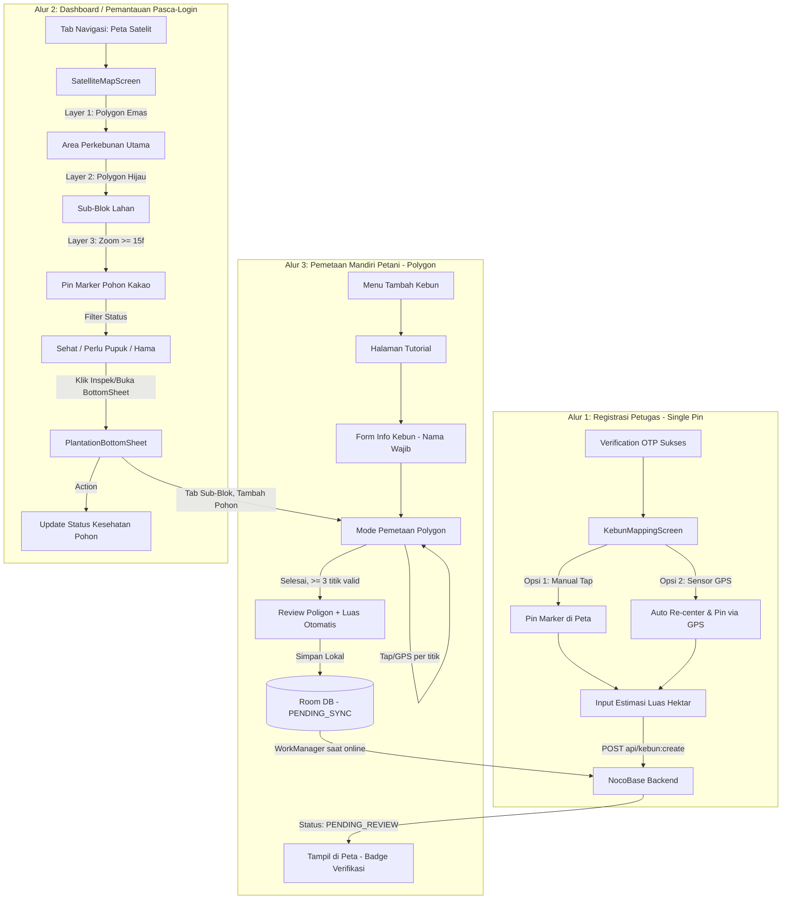

# Dokumentasi Alur UX & Sistem Pemetaan (GIS) Kakao Digital — v2

> **Dokumen ini dirancang sebagai panduan komprehensif bagi Engineer, UI/UX Designer, dan System Architect untuk merancang, mengembangkan, dan memperluas alur pengalaman pengguna (User Experience Flow) serta sistem arsitektur peta pada aplikasi Kakao Digital.**
> Dokumen ini mencakup analisis alur eksisting, hierarki data geospasial, mekanisme rendering interaktif, hingga *blueprint* pengembangan fitur GIS tahap selanjutnya.

### Changelog v2
- **[BARU]** Section 4 — Alur UX 3: Pemetaan Kebun Mandiri oleh Petani (self-service polygon mapping), lengkap dengan validasi geometri, review step, strategi offline-first, status verifikasi, overlap check, dan sub-alur tambah pohon.
- **[UPDATE]** Section 5 — skema data `PlantationModels.kt` ditambah field status verifikasi, sync, metode input pohon, dan relasi blok default.
- **[UPDATE]** Section 6 — roadmap poin 1 ("Polygon Geofence Drawing") ditandai sudah diimplementasikan via Alur 3; poin lain disesuaikan urutannya.
- **[UPDATE]** Section 7 — checklist ditambah item validasi poligon & offline sync.
- Alur 1 (`KebunMappingScreen`, single-pin) **tetap dipertahankan** sebagai jalur onboarding cepat oleh petugas lapangan/penyuluh — bukan digantikan, melainkan dilengkapi oleh Alur 3 untuk kasus pemetaan presisi mandiri oleh petani.

---

## 1. Ringkasan Eksekutif & Struktur Pemetaan

Dalam ekosistem **Kakao Digital (PT. Berau Coal)**, modul pemetaan (Maps/GIS) tidak sekadar menjadi penunjuk lokasi, melainkan instrumen utama untuk:
1. **Validasi Lokasi Pendaftaran (Onboarding Geotagging):** Memastikan kebun calon petani berada di dalam zona hak pilih atau konsesi program pendampingan.
2. **Manajemen Aset Pertanian (Precision Agriculture GIS):** Pemetaan batas area perkebunan (Polygon), subdivisi blok kelola, hingga pemantauan kesehatan per individu pohon kakao secara spasial.
3. **[BARU] Pemetaan Mandiri oleh Petani (Farmer Self-Service GIS):** Memberikan akses langsung kepada petani terverifikasi untuk memetakan batas kebun miliknya sendiri secara presisi (polygon), bukan hanya titik tunggal (centroid).

Implementasi pemetaan dalam repositori kini dibagi menjadi **3 Alur UX Utama**:
- **Alur 1: Penentuan Koordinat Lahan Baru — Onboarding Petugas (Single-Pin)** -> Ditangani oleh [KebunMappingScreen.kt](file:///d:/Berau/kakao-android/app/src/main/java/com/beraucoal/kakao/ui/screens/KebunMappingScreen.kt).
- **Alur 2: Pemantauan Satelit & Inspeksi Lahan (Dashboard Stage)** -> Ditangani oleh [SatelliteMapScreen.kt](file:///d:/Berau/kakao-android/app/src/main/java/com/beraucoal/kakao/ui/screens/SatelliteMapScreen.kt) dan [PlantationBottomSheet.kt](file:///d:/Berau/kakao-android/app/src/main/java/com/beraucoal/kakao/ui/components/PlantationBottomSheet.kt).
- **[BARU] Alur 3: Pemetaan Kebun Mandiri oleh Petani (Self-Service Polygon Mapping)** -> Direncanakan pada `SelfMappingFlow` (Tutorial -> Form -> Mode Pemetaan -> Review -> Sync), lihat Section 4.



---

## 2. Bedah Alur UX 1: Registrasi & Pemetaan Kebun Baru (`KebunMappingScreen`)

Layar [KebunMappingScreen.kt](file:///d:/Berau/kakao-android/app/src/main/java/com/beraucoal/kakao/ui/screens/KebunMappingScreen.kt) diakses pada **Langkah 4 (Tahap Akhir Onboarding)** pasca verifikasi nomor WhatsApp. Alur ini dipertahankan sebagai jalur cepat (single-pin) yang biasanya dieksekusi oleh **petugas lapangan/penyuluh** saat proses pendaftaran awal berlangsung, di mana presisi batas lahan belum menjadi prioritas — cukup titik tengah kebun untuk kebutuhan administratif.

### A. Tujuan & Pengalaman Pengguna (UX)
* **Konteks Lapangan:** Petani atau Petugas Lapangan (Penyuluh) berada di lahan atau di kantor pendaftaran, membutuhkan cara cepat dan akurat untuk merekam titik tengah (Centroid/Marker) dari lahan kakao yang didaftarkan.
* **Tantangan UX:** Petani mungkin tidak terbiasa menggeser peta digital, sehingga antarmuka harus meminimalkan kesalahan ketuk (fat-finger errors) dan menyediakan jalan pintas perangkat keras (GPS).

### B. Alur Interaksi Kritis (Interactive State Flow)
1. **Inisialisasi Kamera Peta:**
   - Peta diaktifkan pada koordinat default **Wilayah Berau, Kalimantan Timur** (`2.1500, 117.4667`) dengan tingkat pergeseran *zoom* `12f`.
   - Menggunakan komponen `GoogleMap` dari library `maps-compose` dengan parameter `MapProperties(isMyLocationEnabled = hasLocationPermission)`.
2. **Akuisisi Koordinat (2 Jalur Input):**
   - **Jalur A - Manual Interactive Mapping:**
     Pengguna mengekstraksi visual peta, menggeser (*pan*) dan memperbesarnya (*zoom*), lalu menyentuh layar (`onMapClick`). Event ini memperbarui state `pinnedLocation` dan langsung menyebarkan animasi marker ke posisi yang disentuh.
   - **Jalur B - Hardware Sensor GPS (Recommended for Field Officers):**
     Jika izin akses lokasi (`ACCESS_FINE_LOCATION`) diizinkan pada awal instalasi, kartu bawah menampilkan tombol utama: **"Gunakan Lokasi GPS Saya Saat Ini"**.
     Saat ditekan, aplikasi memanggil `FusedLocationProviderClient.lastLocation`. Jika koordinat berhasil ditangkap:
     - `pinnedLocation` disetel secara matematis ke lokasi satelit GPS.
     - Kamera peta secara otomatis melompat (*animate camera position*) ke titik tersebut dengan zoom interaktif `16f` (pembesaran detail area kebun).
3. **Pengisian Metadata Tambahan:**
   - Di bawah tombol GPS, tersedia kolom `KakaoOutlinedTextField` untuk pengisian **Estimasi Luas Kebun (Hektar)** yang bersifat opsional.
4. **Validasi & Transisi Data:**
   - Tombol utama **"Simpan & Selesaikan Registrasi"** dikunci (*disabled*) hingga `pinnedLocation != null`.
   - Saat diklik, fungsi `viewModel.submitKebun(lat, lng, luas, onDone)` dipanggil.
   - **Network Pipeline:** Repository memformat DTO `KebunFields` (`petaniId`, `latitude`, `longitude`, `luasHektar`) dan meluncurkan request `POST` ke NocoBase di `api/kebun:create`.
   - Setelah respons kesuksesan diterima (`200/201`), Navigasi melonjak ke layar konfirmasi `Routes.DONE`.

---

## 3. Bedah Alur UX 2: Dashboard Satelit GIS & Inspeksi Lahan (`SatelliteMapScreen`)

Layar [SatelliteMapScreen.kt](file:///d:/Berau/kakao-android/app/src/main/java/com/beraucoal/kakao/ui/screens/SatelliteMapScreen.kt) merupakan jantung dari pengalaman **Monitoring & Manajemen Aset Perkebunan** di dalam aplikasi utama (dapat diakses melalui menu navigasi bawah / `KakaoBottomNavigation`).

### A. Konsep Hierarki Spasial 3-Lapisan (3-Layer GIS Hierarchy)
Untuk mencegah *visual clutter* (terlalu banyak ikon menumpuk di peta) dan menghemat pemrosesan grafis (GPU RAM), antarmuka ini mengimplementasikan teknik **Progressive Disclosure** berbasis level zoom:

| Lapisan Spasial | Representasi UI | Atribut Tampilan | Kondisi Muncul di Peta |
| :--- | :--- | :--- | :--- |
| **Layer 1: Perkebunan (KebunArea)** | Polygon Area Utama (peta keseluruhan milik satu petani) | Isi Emas Transparan (`0x33F1C40F`), Garis Tepi Emas (`5f`) | Selalu muncul pada setiap level zoom |
| **Layer 2: Blok Lahan (BlokBagian)** | Polygon Sub-Divisi *di dalam* KebunArea | Isi Hijau Zamrud Transparan (`0x222ECC71`), Garis Tepi (`3f`) | Selalu muncul di dalam perimeter Layer 1 |
| **Layer 3: Pohon Kakao (PohonKakao)**| Marker / Pin Titik *di dalam* BlokBagian | Ikon Pin dengan variasi warna berdasar status kesehatan | **Hanya muncul saat Zoom Level >= 15f** |

> Catatan hierarki (dikonfirmasi): `BlokBagian` **selalu merupakan sub-divisi di dalam** satu `KebunArea` — tidak pernah berdiri sendiri. `KebunArea` merepresentasikan keseluruhan bidang tanah milik satu petani. Relasi ini menjadi dasar keputusan desain di Section 4.H untuk alur pemetaan mandiri.

### B. Alur Manajemen Kontrol Peta (Top Bar & Floating Controls)
1. **Pilih Kendali Lapisan (Map Type Switcher):**
   - Pengguna dapat mengklik ikon `Layers` di bilah atas untuk berotasi antar mode presentasi citra: `SATELLITE` (Citra Udara/Satelit Asli) ➔ `HYBRID` (Citra Udara + Nama Jalan/Label) ➔ `NORMAL` (Peta Vektor Google konvensional).
2. **Mekanisme Filter Status Real-time (Quick Filter Chips):**
   - Terdapat 3 Chip interaktif di bagian atas:
     - **Semua Pohon:** Menampilkan seluruh titik tanaman yang terdata.
     - **⚠️ Terserang Hama:** Memfilter tampilan agar HANYA menengahkan pohon dengan status `PohonStatus.TERSERANG_HAMA` (Warna Pin Merah).
     - **⚡ Perlu Pupuk:** Menampilkan HANYA pohon dengan status `PohonStatus.PERLU_PUPUK` (Warna Pin Kuning/Gold).
3. **Tombol Interaktif FAB (Floating Action Buttons):**
   - **Location FAB (Atas):** Mengembalikan pusat kamera ke `centerLocation` dari perkebunan yang sedang terpilih di zoom `16f`.
   - **Inspeksi Lahan FAB (Bawah):** Membuka menu inspektor modal (*Modal Bottom Sheet*) untuk manajemen data perkebunan dari perspektif daftar tebal (List & Grid view).

### C. Alur Inspeksi & Modifikasi Data via `PlantationBottomSheet`
Ketika polygon kebun/blok di-klik, atau tombol FAB Inspeksi ditekan, [PlantationBottomSheet.kt](file:///d:/Berau/kakao-android/app/src/main/java/com/beraucoal/kakao/ui/components/PlantationBottomSheet.kt) terbuka meluncur dari bawah layar:
1. **Stat Piles & Header:** Menampilkan judul kebun, nama pemilik, luas hektar, dan 3 pilar statistik kesehatan (`Sehat`, `Butuh Pupuk`, `Hama`) yang berhitung secara dinamis dari agregasi data pohon.
2. **Navigasi 3-Tab Multilevel:**
   - **Tab 0 - Ringkasan (Overview):** Rangkuman metrik produktivitas kebun dan informasi umum.
   - **Tab 1 - Sub-Blok:** Menampilkan daftar divisi Blok. **Interaksi Kritis:** Ketika pengguna mengklik salah satu kartu Sub-Blok, aplikasi merespons dengan memilih blok tersebut (`onBlokSelected(it)`) dan **secara otomatis menggeser fokus pengguna ke Tab 2 (Daftar Pohon)** yang kini tersortir khusus untuk blok yang dipilih.
   - **Tab 2 - Daftar Pohon & Audit Kesehatan:** Menampilkan daftar kartu pohon kakao individual beserta usia, varietas (misal: *MCC 02 Sulawesi 2*), estimasi hasil panen (Kg), dan tanggal pemupukan terakhir. **[BARU]** Tombol "+ Tambah Pohon" pada tab ini memicu sub-alur di Section 4.H — mengharuskan kebun (dan bloknya) sudah terpilih terlebih dahulu, konsisten dengan hierarki data.
3. **Alur Aksi Perubahan Status Kesehatan (Field Audit Flow):**
   - Pengguna (Mandor/Petugas) dapat merubah status kesehatan pohon langsung melalui dropdown/tombol pada kartu pohon.
   - Aksi ini memicu callback `onStatusChange`, yang dieksekusi oleh `plantationRepository.updatePohonStatus()`. Secara real-time, warna pin marker pada `GoogleMap` utama langsung berubah dari Merah ke Hijau (jika terobati) atau dari Hijau ke Kuning (jika masa pemupukan tiba).

---

## 4. [BARU] Bedah Alur UX 3: Pemetaan Kebun Mandiri oleh Petani (Self-Service Polygon Mapping)

Alur ini memberikan kewenangan langsung kepada **petani yang memiliki akses** (role `PETANI_TERVERIFIKASI`) untuk memetakan batas kebunnya sendiri secara presisi berbentuk polygon multi-titik — melengkapi Alur 1 yang bersifat single-pin cepat untuk kebutuhan administratif petugas.

### A. Tujuan & Konteks Akses
* **Siapa yang bisa mengakses:** Hanya petani dengan status akun terverifikasi (sudah lulus onboarding OTP + terdaftar dalam program pendampingan). Menu "Tambah Kebun" tidak tampil untuk akun yang belum diverifikasi.
* **Kapan dipakai:** Setelah onboarding awal (Alur 1) selesai, petani bisa menambahkan satu atau lebih kebun tambahan dengan pemetaan presisi, atau memperbarui batas kebun yang sebelumnya hanya berupa single-pin.
* **Perbedaan dengan Alur 1:** Alur 1 menghasilkan titik tunggal (centroid) + estimasi manual luas hektar. Alur 3 menghasilkan polygon batas lahan yang sebenarnya, dengan luas dihitung otomatis secara geodesik — jauh lebih presisi dan dapat diaudit.

### B. Tahapan Alur (Step-by-Step)

**Step 1 — Halaman Tutorial**
Halaman statis/carousel yang menjelaskan cara memetakan kebun dengan benar: berjalan/berdiri di titik sudut lahan, tekan tombol titik satu per satu mengikuti arah jarum jam, hindari melompati sudut, dan cara memakai tombol undo. Tampilkan sekali di kunjungan pertama, dengan opsi "Jangan tampilkan lagi" — tetap bisa diakses ulang dari menu bantuan.

**Step 2 — Form Info Kebun**
Sebelum masuk mode pemetaan, petani mengisi:
- **Nama Kebun** (wajib, validasi non-empty, disable tombol "Lanjut" jika kosong).
- Detail opsional lain (mis. catatan, jenis kepemilikan lahan).
Ditempatkan **sebelum** mode pemetaan (bukan sesudah) — supaya jika terjadi kegagalan input/validasi, petani tidak kehilangan hasil kerja menitikkan koordinat yang sudah susah payah dilakukan di lapangan.

**Step 3 — Mode Pemetaan Polygon (Live Map)**
- Peta live ditampilkan dengan tombol utama **"Tandai Titik Batas"**. Setiap tekan tombol (atau tap langsung di peta — sediakan dua jalur input, konsisten dengan Alur 1) menyimpan satu koordinat batas ke state `List<LatLng> boundaryPoints`, dan menggambar marker bernomor urut + garis penghubung otomatis ke titik sebelumnya (`Polyline`).
- **Titik pertama diberi penanda visual berbeda** (mis. warna hijau vs titik lain berwarna kuning) sebagai penanda "titik penutup" — begitu mendekati titik ini di akhir, UI memberi indikasi bahwa poligon siap ditutup.
- **Tombol "Undo Titik Terakhir"** aktif selama minimal 1 titik sudah ada — menghapus titik paling akhir dari state dan menggambar ulang garis.
- **Live area counter:** setelah titik ke-3 terbentuk, tampilkan estimasi luas berjalan (hasil `SphericalUtil.computeArea()`) di kartu bawah, sehingga petani mendapat umpan balik langsung tanpa harus input manual.
- **Validasi geometri sebelum tombol "Selesai" aktif:**
  - Minimal 3 titik.
  - Tidak ada segmen garis yang saling berpotongan (self-intersection check, dijalankan setiap kali titik baru ditambahkan agar error terdeteksi sedini mungkin, bukan di akhir).
  - Jika self-intersection terdeteksi, titik terakhir ditolak dengan pesan singkat, bukan disimpan lalu divalidasi belakangan.

**Step 4 — Review Poligon**
Layar konfirmasi menampilkan:
- Preview poligon final di atas peta (read-only, non-editable di layar ini).
- Nama kebun + detail yang sudah diisi di Step 2.
- Luas hasil kalkulasi otomatis (hektar), dengan opsi kecil "koreksi manual" jika petani merasa hasil kalkulasi meleset jauh (mis. akibat drift GPS).
- Tombol **"Edit Titik"** (kembali ke Step 3 dengan titik-titik masih tersimpan) dan **"Konfirmasi & Simpan"**.
Step ini mencegah submit yang tidak disengaja — pola yang sama dipakai pada layar konfirmasi checkout/alamat di aplikasi konsumer pada umumnya.

**Step 5 — Simpan Draft Lokal (Offline-First)**
Begitu "Konfirmasi & Simpan" ditekan, data **disimpan lebih dulu ke Room Database lokal** dengan `syncStatus = PENDING_SYNC` — **tidak menunggu koneksi jaringan**. Ini krusial karena area perkebunan kakao di sekitar Berau kerap mengalami blank spot sinyal (lihat Section 6.2 versi sebelumnya). Petani langsung mendapat konfirmasi "Kebun tersimpan, akan disinkronkan otomatis" tanpa harus menunggu request HTTP selesai.

**Step 6 — Sinkronisasi Latar Belakang**
`WorkManager` memantau ketersediaan koneksi. Begitu jaringan pulih, payload polygon (format GeoJSON atau `List<LatLng>` terstringifikasi) dikirim ke endpoint NocoBase yang sesuai (lihat Section 5). Field `syncStatus` diperbarui menjadi `SYNCED` atau `SYNC_FAILED` (dengan retry otomatis) berdasarkan hasil response.

**Step 7 — Tampil di Peta dengan Status Verifikasi**
Kebun baru langsung muncul di `SatelliteMapScreen` milik petani yang bersangkutan (agar ia mendapat umpan balik visual instan), namun dengan **badge status**: `Menunggu Verifikasi` (kuning) hingga divalidasi oleh mandor/agronomis, baru berubah menjadi `Terverifikasi` (hijau) dan dianggap resmi untuk keperluan program pendampingan. Ini mengurangi risiko klaim batas lahan yang keliru atau tumpang tindih langsung dianggap valid tanpa pengecekan.

### C. Overlap Detection (Deteksi Tumpang Tindih Antar Kebun)
Sebelum Step 5 menyimpan data, jalankan pengecekan (idealnya dua lapis — cepat di client untuk umpan balik instan, dikonfirmasi ulang di server saat sync) apakah polygon baru overlap signifikan dengan `KebunArea` lain yang sudah terverifikasi di sekitarnya. Jika overlap terdeteksi di atas ambang batas tertentu (mis. >5% area), tampilkan peringatan non-blocking di Step 4 (Review) — petani tetap bisa lanjut simpan, namun status otomatis diberi tanda `PENDING_REVIEW` dengan catatan konflik untuk ditinjau manual, alih-alih diam-diam tersimpan sebagai data yang saling tumpang tindih.

### D. [BARU] Sub-Alur Tambah Pohon dari Kebun yang Sudah Dipetakan
Konsisten dengan hierarki data (`KebunArea → BlokBagian → PohonKakao`, lihat catatan di Section 3.A), menambah pohon **selalu** membutuhkan konteks kebun (dan bloknya) yang jelas:
1. Petani membuka `SatelliteMapScreen`, tap polygon kebun miliknya di peta.
2. `PlantationBottomSheet` terbuka pada Tab 1 (Sub-Blok) atau Tab 2 (Daftar Pohon) bila kebun hanya punya satu blok.
3. **Keputusan desain:** Setiap kebun hasil pemetaan mandiri **otomatis dibuatkan satu `BlokBagian` default** (`kodeBlok = "DEFAULT"`, `polygon` sama dengan batas `KebunArea` induknya) saat Step 5 disimpan — sehingga petani smallholder tidak perlu melalui langkah tambahan "buat blok" hanya untuk menambah pohon. Jika ke depan petani ingin membagi kebunnya jadi beberapa blok kelola, opsi "Bagi Blok" bisa ditambahkan sebagai fitur lanjutan opsional, bukan langkah wajib.
4. Tombol "+ Tambah Pohon" pada Tab 2 membuka mode input titik pohon dengan dua metode:
   - **GPS berdiri di bawah pohon (default/disarankan):** karena jarak antar pohon kakao biasanya hanya ~2-3 meter, resolusi citra satelit sering tidak cukup untuk membedakan pohon secara visual — GPS langsung dari lokasi fisik petani jauh lebih akurat.
   - **Tap manual di peta:** sebagai fallback bila sinyal GPS lemah.
5. **Point-in-polygon validation:** titik pohon yang dihasilkan dicek apakah berada di dalam batas `BlokBagian` terpilih. Jika di luar (indikasi drift GPS atau kesalahan tap), tampilkan peringatan dan minta konfirmasi ulang sebelum disimpan.
6. Data pohon (`id`, `kodePohon`, `location`, `umurTahun`, `varietasKakao`, `inputMethod`) disimpan lokal dulu (pola offline-first yang sama seperti Step 5) lalu disinkronkan.

### E. Alur Edit Kebun Pasca-Submit
Kebun yang sudah tersimpan (baik status `PENDING_REVIEW` maupun `VERIFIED`) tetap bisa dikoreksi:
- Dari `PlantationBottomSheet` Tab 0 (Ringkasan), sediakan tombol "Edit Batas Kebun" yang membuka kembali Step 3 (Mode Pemetaan) dengan titik-titik existing termuat dan dapat digeser/ditambah/dihapus, bukan hanya diulang dari nol.
- Jika kebun berstatus `VERIFIED` dan diedit, status otomatis kembali ke `PENDING_REVIEW` — perubahan batas lahan yang sudah diverifikasi tetap perlu ditinjau ulang.

---

## 5. Arsitektur Teknis & Struktur Skema Data (Data Model & Schema Reference)

Untuk mendukung ketiga alur GIS di atas, arsitektur data dibentuk dan dikunci di dalam [PlantationModels.kt](file:///d:/Berau/kakao-android/app/src/main/java/com/beraucoal/kakao/data/PlantationModels.kt). Berikut skema struktural yang telah diperbarui:

```kotlin
// Status Kesehatan dengan Kodifikasi Label
enum class PohonStatus(val label: String) {
    SEHAT("Sehat"),
    PERLU_PUPUK("Butuh Pemupukan"),
    TERSERANG_HAMA("Terserang Hama PBK/VSD")
}

// [BARU] Status verifikasi kebun hasil pemetaan (Alur 1 maupun Alur 3)
enum class KebunVerificationStatus(val label: String) {
    DRAFT("Draft - belum dikirim"),
    PENDING_REVIEW("Menunggu Verifikasi"),
    VERIFIED("Terverifikasi"),
    REJECTED("Perlu Revisi")
}

// [BARU] Status sinkronisasi lokal <-> server, dipakai oleh KebunArea & PohonKakao
enum class SyncStatus {
    PENDING_SYNC,
    SYNCED,
    SYNC_FAILED
}

// [BARU] Metode input koordinat pohon, untuk audit kualitas data
enum class PohonInputMethod {
    GPS_LAPANGAN,
    MANUAL_TAP_PETA
}

// Entity Lapisan 3: Individu Pohon
data class PohonKakao(
    val id: String,
    val kodePohon: String,              // Contoh: "P-01-A"
    val location: LatLng,               // Titik Koordinat Presisi
    val umurTahun: Double,              // Usia tanaman (Tahun)
    val status: PohonStatus,            // Enumerasi Status
    val tanggalPemupukanTerakhir: String,
    val varietasKakao: String = "MCC 02 (Sulawesi 2)",
    val estimasiHasilKg: Double = 3.5,
    val catatanPetani: String,
    val inputMethod: PohonInputMethod = PohonInputMethod.MANUAL_TAP_PETA,  // [BARU]
    val syncStatus: SyncStatus = SyncStatus.SYNCED                        // [BARU]
)

// Entity Lapisan 2: Divisi Sub-Blok (selalu berada di dalam satu KebunArea)
data class BlokBagian(
    val id: String,
    val kodeBlok: String,
    val namaBlok: String,
    val polygon: List<LatLng>,          // Rangkaian koordinat penutup area Blok
    val pohonList: List<PohonKakao>,    // Relasi One-to-Many ke Pohon
    val isDefaultBlok: Boolean = false  // [BARU] true jika auto-generated dari pemetaan mandiri (Alur 3)
) {
    val totalPohon: Int get() = pohonList.size
    val pohonSehatCount: Int get() = pohonList.count { it.status == PohonStatus.SEHAT }
    val pohonHamaCount: Int get() = pohonList.count { it.status == PohonStatus.TERSERANG_HAMA }
    val pohonPupukCount: Int get() = pohonList.count { it.status == PohonStatus.PERLU_PUPUK }
}

// Entity Lapisan 1: Induk Perkebunan (mencakup peta keseluruhan milik satu petani)
data class KebunArea(
    val id: String,
    val namaKebun: String,
    val namaPemilik: String,
    val idPetani: String,
    val nomorWa: String,
    val luasHektar: Double,             // Manual (Alur 1) atau hasil kalkulasi geodesik (Alur 3)
    val centerLocation: LatLng,         // Centroid untuk fokus kamera default
    val polygon: List<LatLng>,          // Rangkaian koordinat batas terluar Lahan (min. 3 titik utk Alur 3)
    val blokList: List<BlokBagian>,     // Relasi One-to-Many ke Sub-Blok
    val isSelfMapped: Boolean = false,               // [BARU] true jika berasal dari Alur 3
    val verificationStatus: KebunVerificationStatus = KebunVerificationStatus.VERIFIED, // [BARU]
    val syncStatus: SyncStatus = SyncStatus.SYNCED,  // [BARU]
    val overlapFlag: Boolean = false                 // [BARU] true jika terdeteksi overlap saat submit
)
```

### Catatan Endpoint NocoBase (target arsitektur, lihat juga Section 6 poin 2)
- `POST api/kebun:create` — dipakai Alur 1 (single-pin) dan Alur 3 Step 6 (polygon), dibedakan lewat field `isSelfMapped` + `polygon` (array vs single point).
- `PATCH api/kebun:update/:id` — dipakai oleh alur Edit Kebun (Section 4.E), termasuk reset `verificationStatus` ke `PENDING_REVIEW`.
- `POST api/pohon_kakao:create` — dipakai sub-alur tambah pohon (Section 4.D), wajib menyertakan `blok_id`.
- `GET api/kebun:list?filter[overlap_check]=...` — dipanggil saat Step 4 (Review) untuk overlap detection sisi server sebagai konfirmasi ulang atas hasil cek client.

---

## 6. Blueprint & Roadmap Pengembangan Sistem Pemetaan Lanjutan (Next-Step Development)

Sebagai panduan pengembangan lebih lanjut, berikut pilar rancang bangun yang relevan untuk tahap berikutnya:

### 1. ~~Evolusi UX Registrasi: dari "Single-Pin" ke "Polygon Geofence Drawing"~~ — **[Diimplementasikan sebagai Alur 3, Section 4]**
Kalkulator luas otomatis (`SphericalUtil.computeArea()`), tombol Undo/Redo, dan mode gambar titik batas kini terspesifikasi penuh di Section 4.B Step 3. Sisa pekerjaan: implementasi UI aktual mengikuti spesifikasi tersebut.

### 2. Mekanisme Offline Tile Caching & Sync (Daerah Blank Spot Berau)
* **Kondisi Lapangan:** Lahan kakao di sekitar lingkar perkebunan atau kawasan konsesi tambang kerap mengalami defisit sinyal seluler 4G (Offline / Blank Spot).
* **Solusi Pengembangan:**
  - **Offline Base Maps:** Implementasikan mekanisme caching peta satelit lokal menggunakan penyimpanan sementara SQLite / MBTiles atau konfigurasi offline region dari Mapbox / Google Maps Offline Caching sebelum petugas turun ke lapangan (saat masih terhubung ke Wi-Fi kantor). Ini melengkapi strategi offline-first yang sudah dispesifikasikan untuk data (Section 4.B Step 5) — Section ini fokus pada offline *tile imagery*-nya.
  - **Local Event Queue (Room Database + NocoBase Sync):** Pola yang sama dengan Section 4.B Step 5/6 berlaku juga untuk modifikasi status pohon dari `PlantationBottomSheet` — `sync_status = PENDING`, ditembakkan via `WorkManager` batch job begitu koneksi pulih.

### 3. Sinkronisasi GIS REST API NocoBase yang Sebenarnya
* **Kondisi Saat Ini:** Fitur di `SatelliteMapScreen` masih ditopang oleh `PlantationRepository.kt` lokal/mock di memori client.
* **Arsitektur Target Backend NocoBase:**
  - Siapkan tabel relational: `kebun_polygon`, `blok_lahan`, `pohon_kakao` — ditambah kolom `verification_status`, `sync_status`, `is_self_mapped` pada `kebun_polygon` sesuai skema Section 5.
  - Buat korelasi Foreign Key: `pohon_kakao.blok_id -> blok_lahan.id` dan `blok_lahan.kebun_id -> kebun_polygon.id`.
  - Pada layer Android Network (`ApiService.kt`), buat DTO yang merubah struktur JSON polygon dari NocoBase (GeoJSON standar type `Polygon`) ke model `List<LatLng>`.

### 4. Navigasi Lapangan & Audio Alert (Turn-by-Turn Tree Inspector)
* **Fitur Mandor:** Ketika mandor memilih pohon berstatus `TERSERANG_HAMA` di peta satelit, sediakan tombol **"Pandu ke Pohon Ini (Navigate)"**.
* **Algoritma UI:** Menggambar garis vektor linier (*Polyline*) dari lokasi GPS terkini pengguna (`MyLocation`) menuju koordinat `PohonKakao.location`.
* **Proximity Haptic/Sound:** Ketika jarak meter GPS pengguna dengan koordinat pohon sudah kurang dari < 3 meter, HP memberikan getaran kencang (*Vibration Haptic Feedback*) dan suara untuk penanda bahwa mandor sudah berada di depan pohon sakit yang wajib diinspeksi.

### 5. Filter Lanjutan Berbasis Usia & Jadwal Pemupukan
* Tingkatkan filter chip di [SatelliteMapScreen.kt](file:///d:/Berau/kakao-android/app/src/main/java/com/beraucoal/kakao/ui/screens/SatelliteMapScreen.kt) dari sekadar filter 3 Status Kesehatan menjadi filter berlapis:
  - *Filter Usia Tanam:* (e.g., "< 1 Tahun", "1-3 Tahun (Produktif)", "> 5 Tahun").
  - *Filter Jadwal:* "Jatuh Tempo Pupuk Bulan Ini", "Telah Disemprot Fungisida".

### 6. [BARU] Panel Moderasi Verifikasi Kebun (Admin/Mandor)
* Dashboard terpisah (web atau in-app role `MANDOR`/`AGRONOMIS`) untuk meninjau kebun berstatus `PENDING_REVIEW`, membandingkan polygon dengan citra satelit terbaru, menyetujui (`VERIFIED`) atau menolak dengan catatan (`REJECTED`) yang dikirim kembali ke petani.
* Termasuk tampilan khusus untuk kebun dengan `overlapFlag = true`, menampilkan kedua polygon yang bertabrakan berdampingan untuk mempermudah keputusan.

---

## 7. Checklist Verifikasi Implementasi Peta

Bagi engineer atau AI yang akan mengekstender kode peta di masa depan, pastikan standar checklist ini terpenuhi sebelum melakukan commit:

- [ ] **Google Maps API Key:** Pastikan tag `<meta-data android:name="com.google.android.geo.API_KEY" android:value="..."/>` di `AndroidManifest.xml` terisi dengan API Key valid berlisensi Google Cloud Mappings agar peta tidak merender layar kosong / blank hitam.
- [ ] **Izin Lokasi (Permissions):** Pastikan pengecekan runtime untuk `Manifest.permission.ACCESS_FINE_LOCATION` telah ditangani di UI lapang sebelum mengakses Fused Location Client atau menyalakan layer `isMyLocationEnabled = true`.
- [ ] **Optimalisasi Zoom Rendering:** JANGAN MENGHAPUS kondisi `if (cameraPositionState.position.zoom >= 15f)` pada rendering Marker pohon di `SatelliteMapScreen`. Merender ribuan Marker secara simultan di level zoom jauh akan menyebabkan kejenuhan memori (Out Of Memory / UI Freeze).
- [ ] **Integrasi State UDF:** Saat memperbarui koordinat kebun maupun status pohon, pastikan mutasi state dilakukan dari dalam `ViewModel` / `Repository` via `StateFlow` untuk menjamin keselarasan render Jetpack Compose.
- [ ] **[BARU] Validasi Poligon Client-Side:** Mode pemetaan (Alur 3) TIDAK BOLEH mengizinkan tombol "Selesai" aktif jika titik < 3 atau self-intersection terdeteksi. Validasi ini wajib berjalan setiap penambahan titik, bukan hanya saat submit.
- [ ] **[BARU] Offline-First untuk Data Tulis:** Setiap operasi simpan (kebun baru, pohon baru, update status) WAJIB menulis ke Room DB lokal terlebih dahulu (`syncStatus = PENDING_SYNC`) sebelum mencoba request jaringan — jangan blocking UI menunggu response HTTP di area yang diketahui rawan blank spot.
- [ ] **[BARU] Point-in-Polygon untuk Pohon Baru:** Titik pohon hasil GPS/tap wajib divalidasi berada di dalam `BlokBagian.polygon` terkait sebelum disimpan; tampilkan konfirmasi eksplisit jika di luar batas.
- [ ] **[BARU] Status Verifikasi Tidak Boleh Di-skip:** Kebun hasil Alur 3 default berstatus `PENDING_REVIEW`, bukan langsung `VERIFIED` — pastikan tidak ada jalur kode yang menimpa status ini secara otomatis tanpa proses moderasi.
